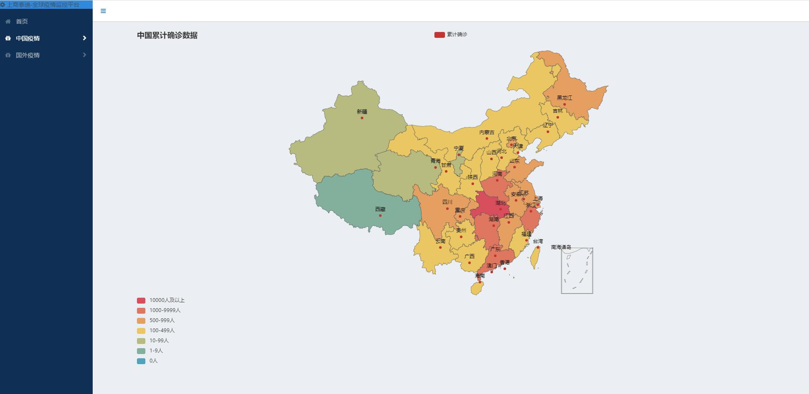
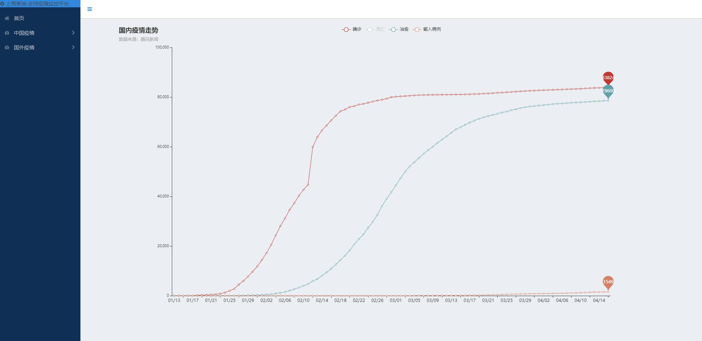
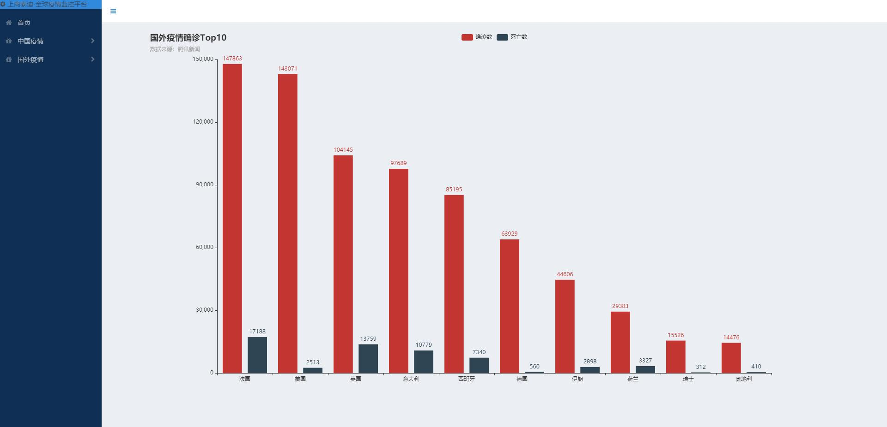

# Covid19_pyecharts_visualization_local
基于Python + Flask + PyEcharts + Bootstrap实现的疫情可视化平台demo  
http://139.224.2.57:776

# 依赖库
| Dependency | Version |  
| ------ |------|  
| Python | 3.6 |
| flask | 1.1.1 |
| pyecharts | 1.7.1 |
| requests | 2.22 |


# 使用
```
python run.py
# 在浏览器中访问http://localhost:776
```
# 前端展示
  

 
 
  
