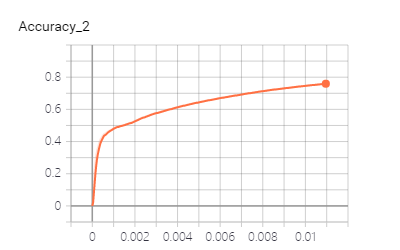
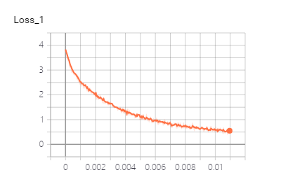

# 利用循环神经网络对路透社新闻进行分类
本项目综合了文本处理、人工智能、TensorFlow V1深度学习框架等技术，主要使用基于动态路由的RNN模型对路透社新闻进行分类。

# 训练/测试环境
```
GPU: RTX2080 8G
CPU: i9 9900KF
RAM: 32 GB
```

# 依赖环境
| Dependency | Version | 
| ------ | ------ | 
| Python | 3.6 |
| CUDA | 10.0 |
| CuDNN | 7.6.5 |
| tensorflow-gpu | 1.15.0 |
| tensorboard | 2.1.0|
| numpy | 1.18.2 |

# 训练/测试结果
    训练结果： 
        step 1 : loss= 3.384684 acc= 0.43925
        step 2 : loss= 2.7131023 acc= 0.48369697
        step 3 : loss= 2.304914 acc= 0.50972
        step 4 : loss= 1.9778494 acc= 0.5353433
        step 5 : loss= 1.7176147 acc= 0.5663095
        step 6 : loss= 1.4958067 acc= 0.5955446
        step 7 : loss= 1.3065137 acc= 0.6201186
        step 8 : loss= 1.1557478 acc= 0.642163
        step 9 : loss= 1.0418674 acc= 0.6613684
        step 10 : loss= 0.94740117 acc= 0.6780237
        step 11 : loss= 0.8695951 acc= 0.69274193
        step 12 : loss= 0.79980373 acc= 0.70608866
        step 13 : loss= 0.7421012 acc= 0.71797276
        step 14 : loss= 0.6845122 acc= 0.7285232
        step 15 : loss= 0.6364063 acc= 0.73828346
        step 16 : loss= 0.5952551 acc= 0.7472989
        step 17 : loss= 0.5602316 acc= 0.75559723
        step 18 : loss= 0.51620966 acc= 0.76333773
   
    
    测试结果：
        Loss: 1.4873619
        Accuracy: 0.6709706


